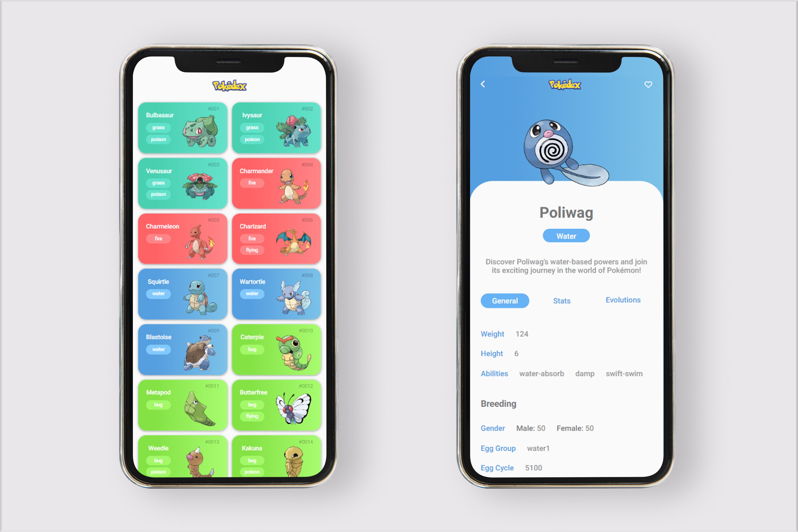

Ivan Wagner

# ⚡️ Pokedex
  

> Part of [DIO](https://web.dio.me/) Bootcamp full-stack Angular + Java project.

## 👩‍💻 The project

    The project consists on simulating a pokedex from Pokemon. All data is called through Pokeapi.

### 💻 Technologies

- Javascript 
- HTML 
- CSS 
